# Music Player Project 🎵

This project is a **Flutter + Java Backend** music player app.  
Here are some screenshots from our app:

## Screenshots

### App Icon
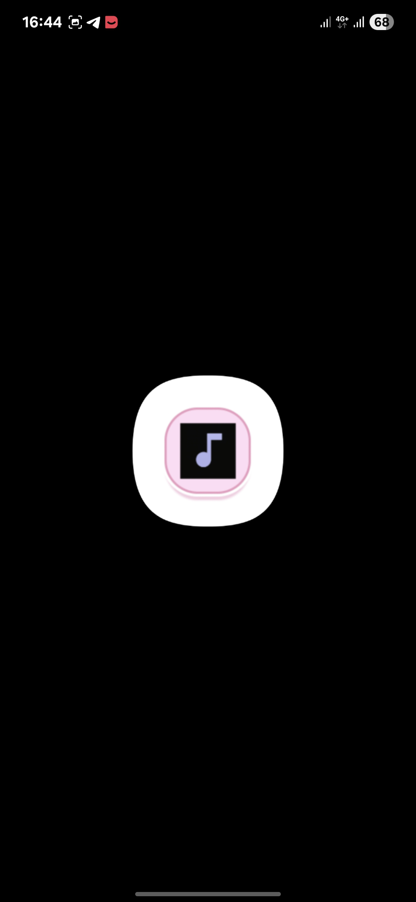

### Loading Page
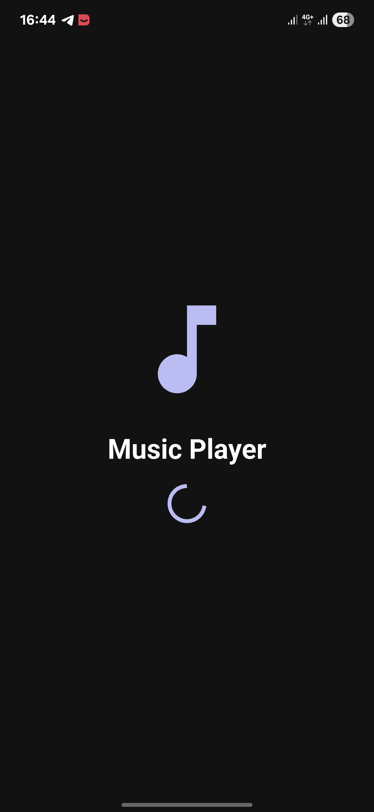

### Local Page
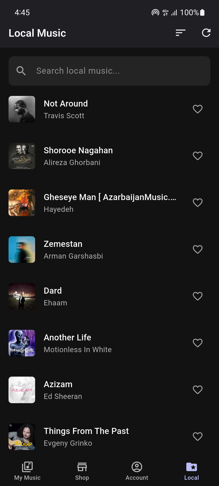

### Home Page

### Favorite Page

### Song Detail Page
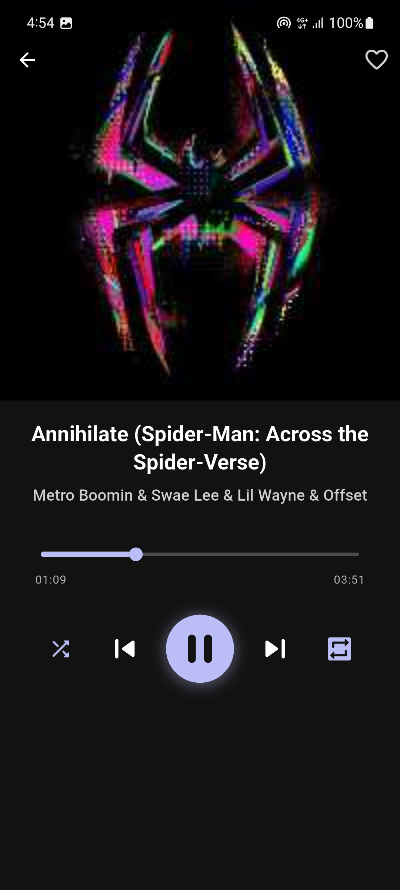

### Sort Local Page
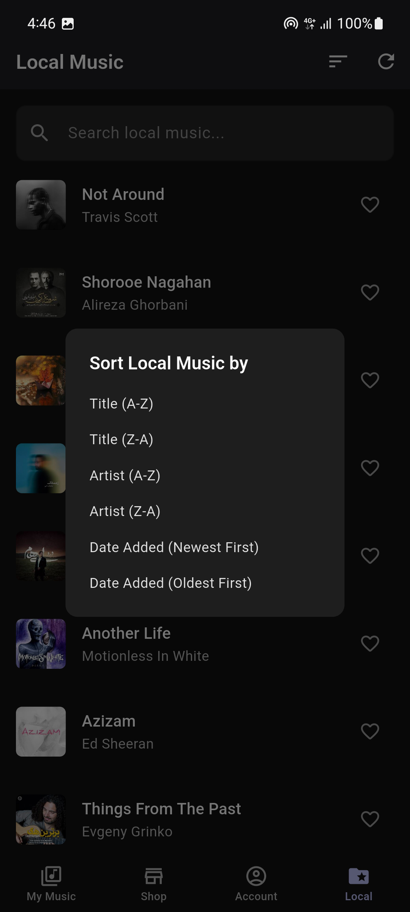

### Create Account Page
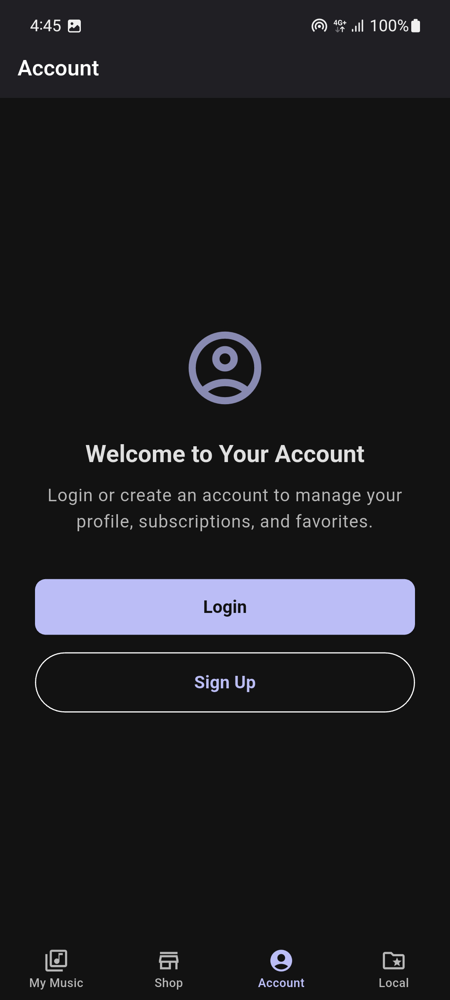

### Login Page
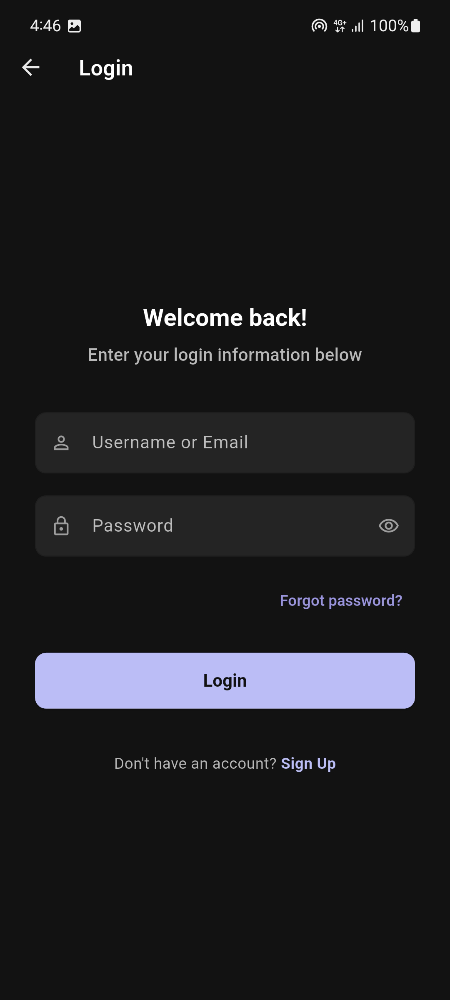

### Signup Page
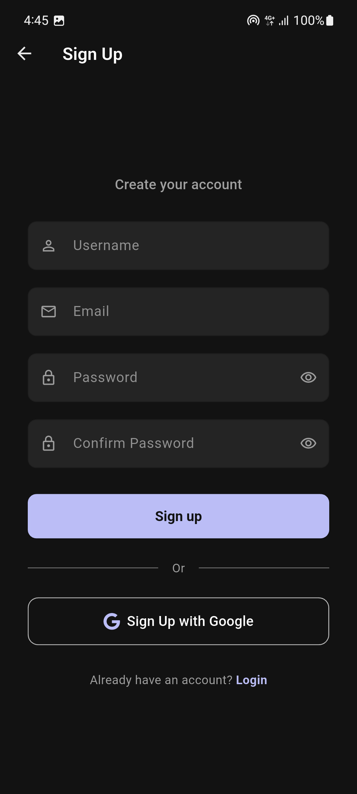

### User Profile Page

### Edit Profile Page
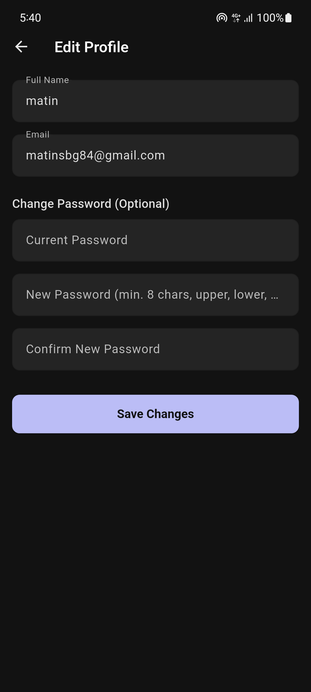

### Add Credit Section
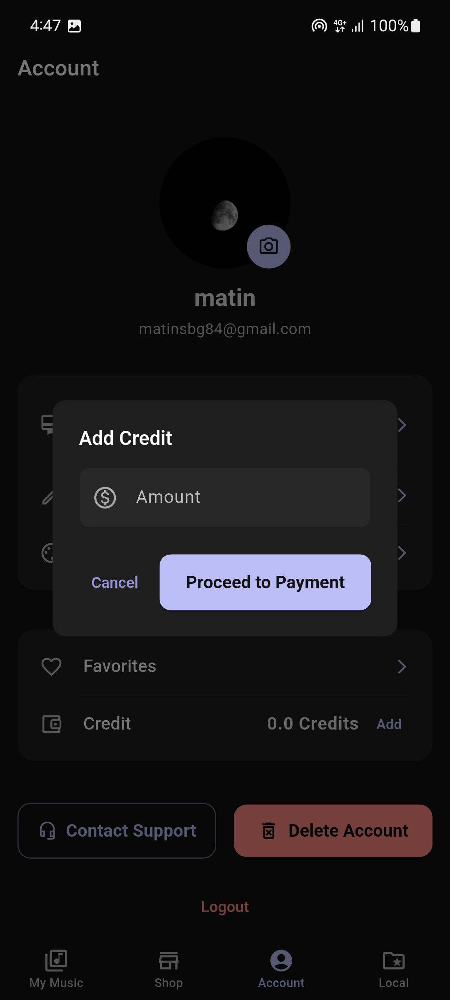

### App Theme Section
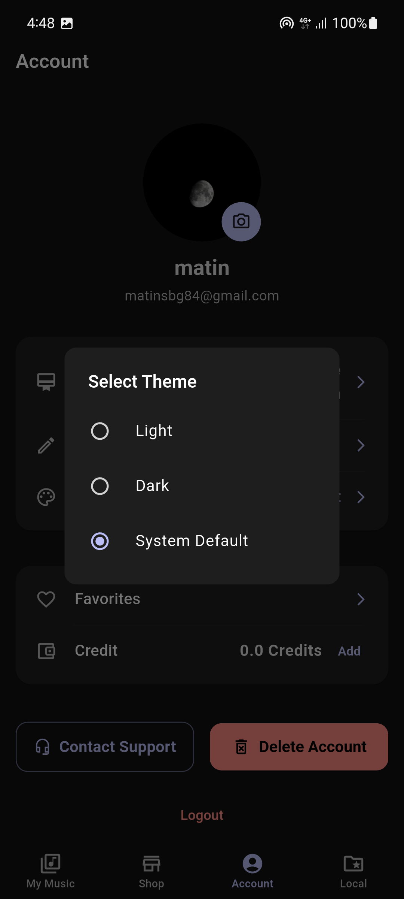

### Subscription Page
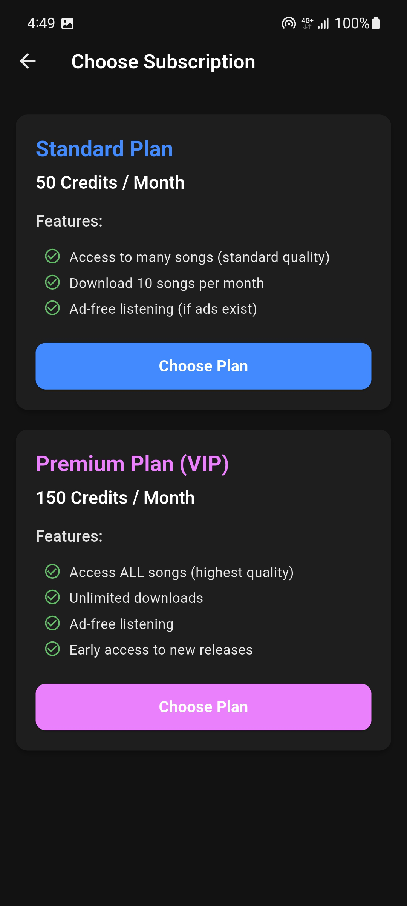

### Payment Page
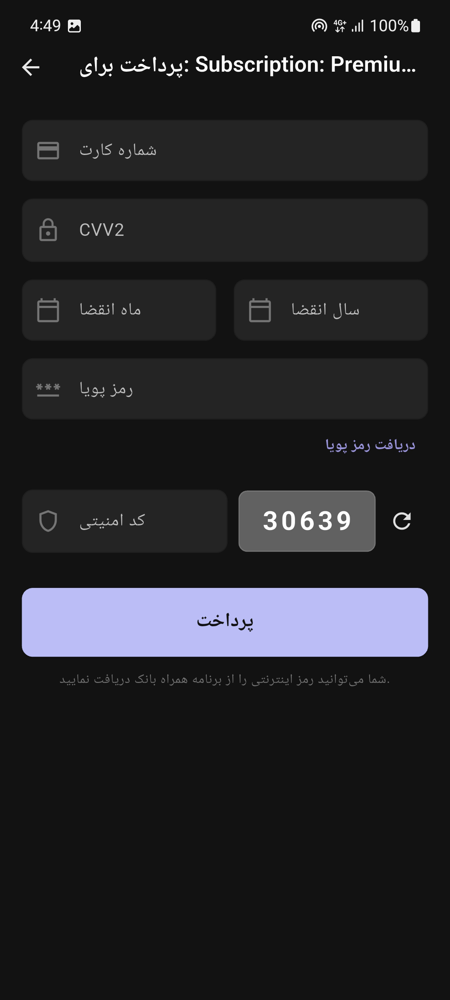

### Chosen Subscription Page
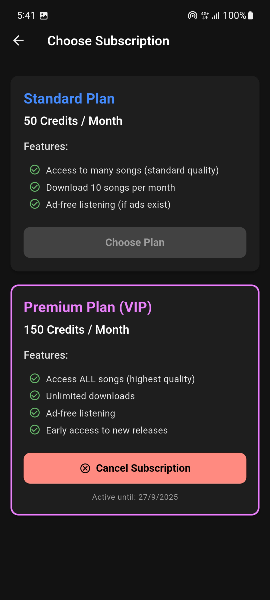

### Shop Category Page
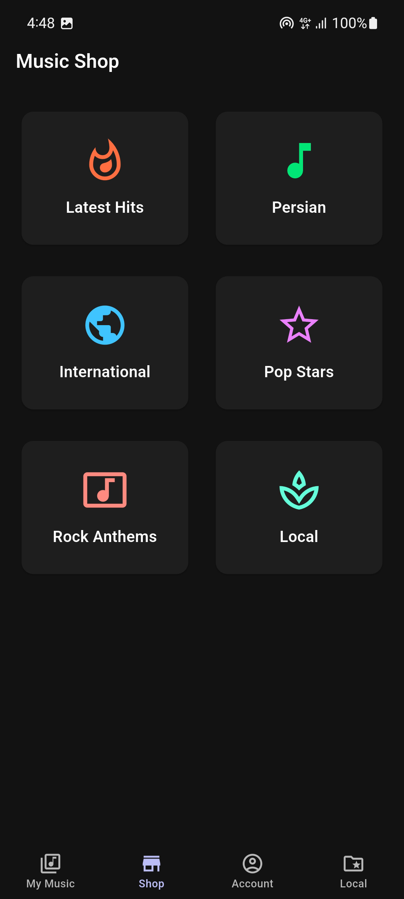

### Shop Songs Page
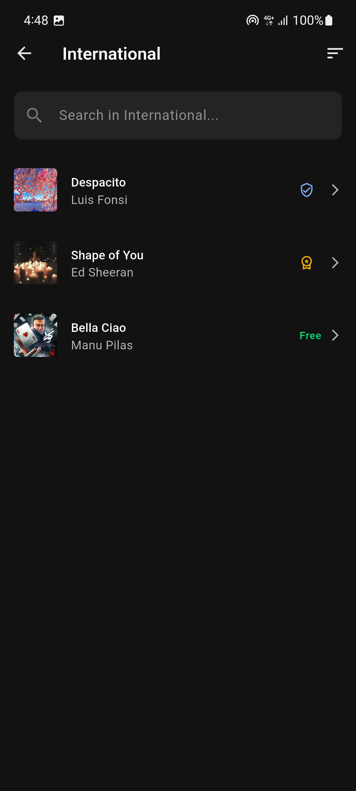

### Sort Shop Songs Page
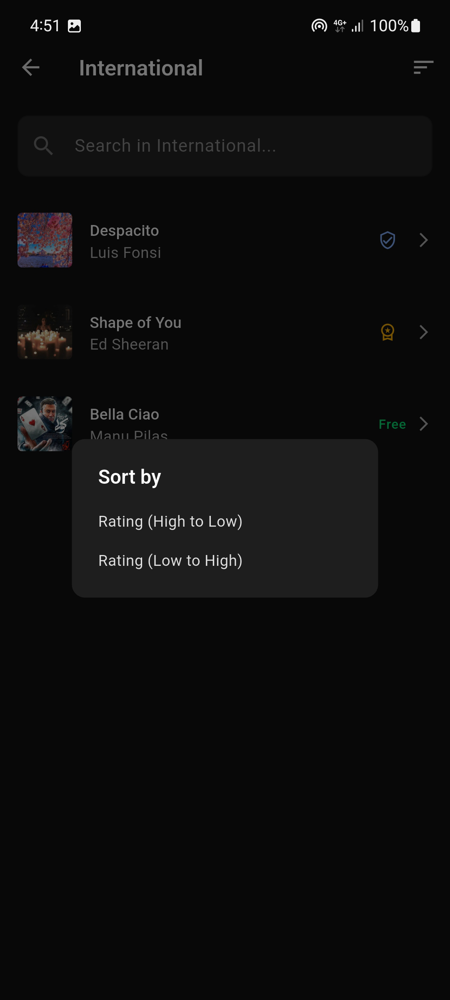

### Song Premium Detail Page
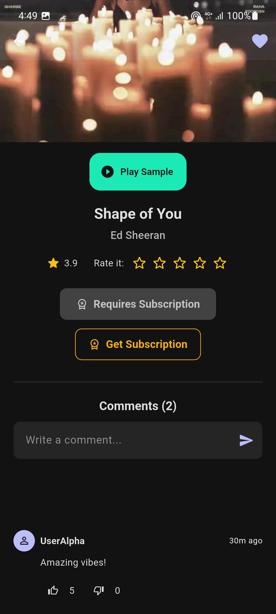

### Song Free Detail Page
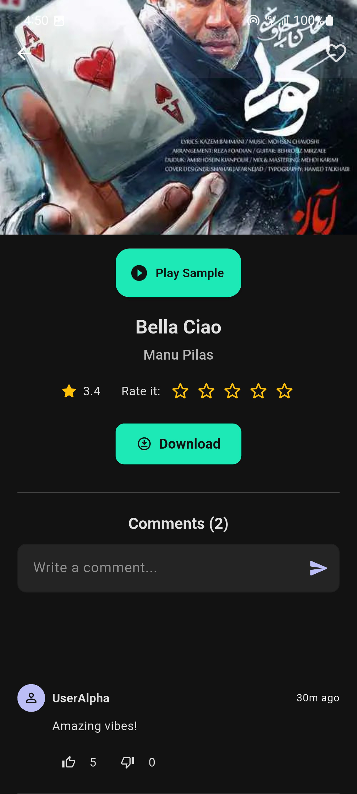

## Backend
The backend is implemented in **Java** with socket programming and file-based database.

## Frontend
The frontend is built with **Flutter**, providing a modern UI/UX.

