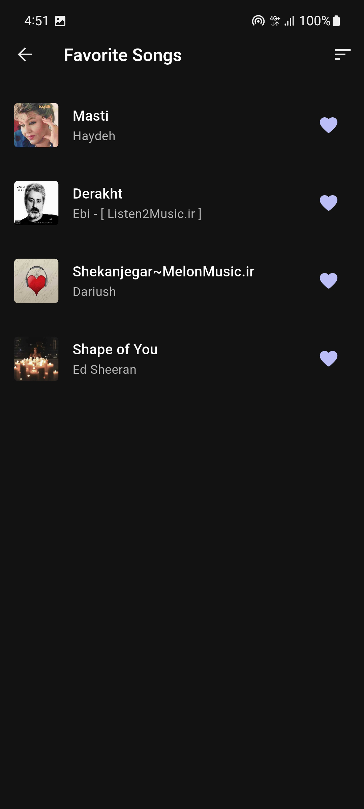

# Music Player Project 🎵

This project is a **Flutter + Java Backend** music player app.  
Here are some screenshots from our app:

## Screenshots

### Local Page

### Home Page

### Favorite Page

## Backend
The backend is implemented in **Java** with socket programming and file-based database.

## Frontend
The frontend is built with **Flutter**, providing a modern UI/UX.

