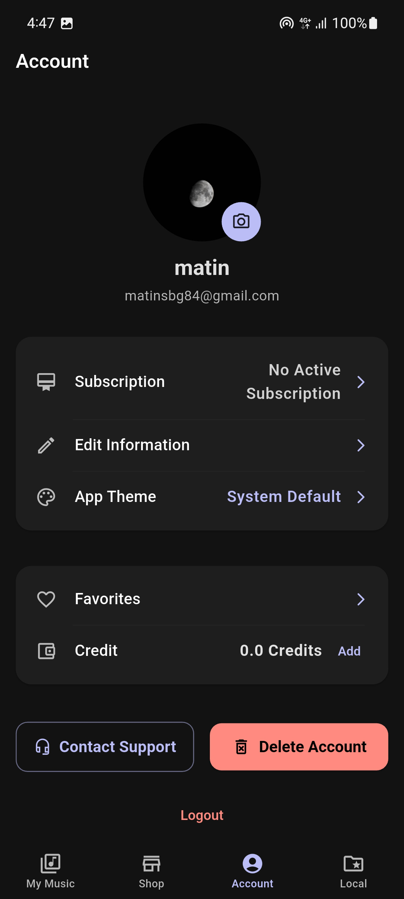

# Music Player Project 🎵

This project is a **Flutter + Java Backend** music player app.  
Here are some screenshots from our app:

## Screenshots

### App Icon

### Loading Page

### Local Page

### Home Page

### Favorite Page

### Song Detail Page

### Sort Local Page

### Create Account Page

### Login Page

### Signup Page

### User Profile Page

### Edit Profile Page

### Add Credit Section

### App Theme Section

### Subscription Page

### Payment Page

### Chosen Subscription Page

### Shop Category Page

### Shop Songs Page

### Sort Shop Songs Page

### Song Premium Detail Page

### Song Free Detail Page

## Backend
The backend is implemented in **Java** with socket programming and file-based database.

## Frontend
The frontend is built with **Flutter**, providing a modern UI/UX.

